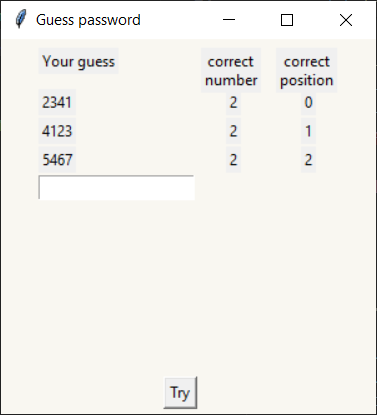

# Guess Password Game

## Description
This is a simple number guessing game built using Python's Tkinter library. The game generates a random 4-digit number for the player to guess within 10 attempts. After each attempt, the player receives feedback on the number of correct digits and correct placements.

## Installation
1. Download the latest release from the [Release Page](https://github.com/Vasya-556/Password_Game/releases/tag/v1.0.0).
2. Extract the downloaded zip file.
3. Navigate to the extracted directory.
4. Turn of antivirus
5. Run the executable

## How to Play
1. Upon running the script, a window titled "Guess password" will appear.
2. Click on the "Start" button to begin the game.
3. A window will display allowing you to input your guess.
4. Enter a 4-digit number in the entry field and click the "Try" button to submit your guess.
5. After each attempt, the game will provide feedback on the number of correct digits and correct placements.
6. Continue guessing until you correctly guess the number within 10 attempts or exhaust all attempts.
7. After the game ends, you can choose to try again or return to the main menu.

## Rules
- The game generates a random 4-digit number consisting of digits from 1 to 9.
- You have 10 attempts to guess the correct number.
- After each attempt, the game provides feedback on the number of correct digits and correct placements.
- Duplicate digits are not allowed in the guess.
- The game ends when you correctly guess the number within 10 attempts or exhaust all attempts.

## License
This project is licensed under the [MIT License](LICENSE).